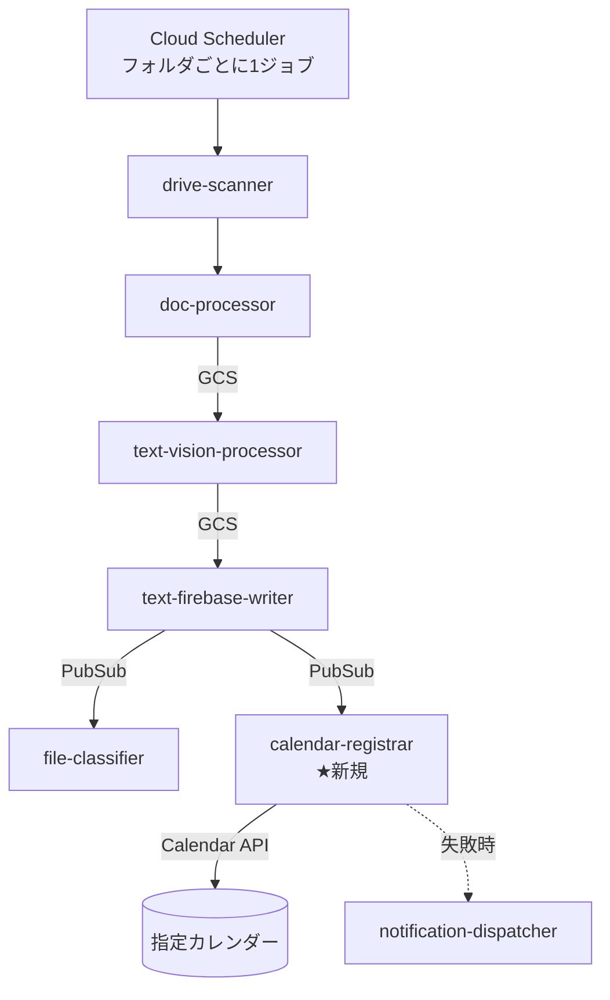

# Google Calendar 連携 設計

Google Drive の**複数の特定フォルダ**に追加されたドキュメントの内容から予定を抽出し、
**フォルダごとに指定された Google Calendar** に予定を登録する機能の設計。

本ドキュメントは設計のみで、実装は含まない。用語・パターンは `CLAUDE.md`
（イベント駆動パイプライン、Terraform モジュール、共有ユーティリティ）に従う。

## 1. 要件

| #   | 要件                                                                               |
| --- | ---------------------------------------------------------------------------------- |
| R1  | 監視対象は Drive の**複数フォルダ**。フォルダは設定で増減できる                    |
| R2  | 登録先カレンダーは**フォルダごとに指定**できる（フォルダ → カレンダーの写像）      |
| R3  | ドキュメント本文（OCR 済みテキスト）から日時・件名・場所を抽出する                 |
| R4  | 同じファイルを再処理しても予定が重複登録されない（冪等）                           |
| R5  | 抽出に失敗した／予定が含まれないドキュメントは、パイプラインを止めずにスキップする |
| R6  | サービスアカウント鍵を新たに増やさない（既存の最小権限方針を維持）                 |

非対象（今回のスコープ外、§10 に将来検討として記載）:
予定の更新・削除の追従、参加者の自動招待、成功時メール通知の本文拡張。

## 2. 全体アーキテクチャ

既存パイプラインは「Drive 発見 → GCS 取込 → Vision OCR → Firestore 保存 → 分類・移動」の
4+1 段。カレンダー登録は**分類と並列な枝**として追加する。テキスト抽出までの
コスト（Drive ダウンロード / Vision）は既存段と共有し、二重処理しない。



新規要素は 1 つだけ:

- **`calendar-registrar`**（新 Cloud Function / PubSub トリガ）
  抽出済みテキストから予定を構造化抽出し、対象カレンダーに登録する。

既存への変更は 3 箇所の小さな追加（§4）。

### なぜ text-firebase-writer から分岐するか

- OCR 済みテキストが揃う最初の地点であり、`file-classifier` と**同じ扱い**で
  ファンアウトできる（既存パターンの踏襲、`CLAUDE.md` の「疎結合」原則）。
- `file-classifier` の後段にすると、分類・移動の成否にカレンダー登録が引きずられる。
  両者は独立した関心事なので並列にする。ファイル移動後も `fileId` と
  `webViewLink` は不変なので、予定に貼るリンクは壊れない。

## 3. フォルダ → カレンダーのマッピング

### 3.1 設定（Terraform 変数）

```hcl
variable "calendar_watch_folders" {
  description = "Drive フォルダと登録先 Google Calendar の対応。監視対象を増やす唯一の入口"
  type = list(object({
    folder_id   = string           # 監視する Drive フォルダ ID
    calendar_id = string           # 登録先カレンダー ID (…@group.calendar.google.com)
    label       = optional(string) # ログ・通知に出す表示名
  }))
  default = []
}
```

環境ごとに `terraform/environments/${ENVIRONMENT}.tfvars`（gitignore 済み）で与える。
CI では GitHub Environment Secret `CALENDAR_WATCH_FOLDERS`（JSON 文字列）として渡し、
既存の `DRIVE_FOLDER_ID` 等と同じ流儀に合わせる。

### 3.2 スケジューラ

既存の単一ジョブ（`var.drive_folder_id`）はそのまま残し、監視フォルダごとに
`for_each` でジョブを追加する。publish 先は既存の drive-scanner トピックで、
関数側の変更は不要。

```hcl
resource "google_cloud_scheduler_job" "calendar_folder_scan" {
  for_each = { for f in var.calendar_watch_folders : f.folder_id => f }

  name     = "${var.environment}-calendar-scan-${substr(sha256(each.key), 0, 8)}"
  schedule = var.drive_scanner_schedule
  region   = var.region

  pubsub_target {
    topic_name = module.drive_scanner.topic_id
    data       = base64encode(jsonencode({ folderId = each.key }))
  }
}
```

ジョブ名にフォルダ ID を直接使わない理由: Drive のフォルダ ID は大文字・`-`・`_` を
含み、Cloud Scheduler のジョブ名制約（小文字英数とハイフン）を満たさないため、
ハッシュ接頭辞で安定した名前を作る。

同じフォルダが分類用ジョブとカレンダー用ジョブの両方に含まれても問題ない。
drive-scanner の `scanned_files` による `(fileId, modifiedTime)` 重複排除が効き、
下流には 1 回しか流れず、そこから両方の枝にファンアウトする。

### 3.3 マッピングの解決場所

写像は **`calendar-registrar` の環境変数 `CALENDAR_WATCH_FOLDERS`（JSON）だけ**が持つ。
上流（drive-scanner / doc-processor / text-firebase-writer）はカレンダーの存在を知らない。

上流が運ぶのは「このファイルはどのフォルダ由来か」という 1 情報のみ:

- drive-scanner → doc-processor: PubSub メッセージに `folderId`（**既存で送信済み**）
- doc-processor → GCS: オブジェクトのカスタムメタデータに `sourceFolderId` を**追加**
- text-firebase-writer: 元ドキュメントオブジェクトのメタデータから読み出して転送

GCS メタデータを使うのは、Storage トリガ段でメッセージ本文が失われるためで、
`originalFileId` / `originalFileName` と同じ既存の受け渡し手段に乗せる。

## 4. 既存コンポーネントへの変更

| コンポーネント         | 変更                                                                                      | 影響                                   |
| ---------------------- | ----------------------------------------------------------------------------------------- | -------------------------------------- |
| `doc-processor`        | GCS カスタムメタデータに `sourceFolderId` を追加                                          | 追加フィールドのみ。既読フィールド不変 |
| `text-firebase-writer` | `CALENDAR_REGISTRAR_TOPIC` が設定されていれば、分類トリガと同様に publish（失敗は非致命） | 既存の `FILE_CLASSIFIER_TOPIC` と同形  |
| `terraform/main.tf`    | `calendar-registrar` モジュール追加、Calendar API 有効化、スケジューラ `for_each`         | —                                      |

`text-firebase-writer` は**フォルダを判定しない**（全ファイルを publish する）。
判定を registrar 側に寄せることで、写像の定義が 1 箇所に留まる。監視対象外の
フォルダのメッセージは registrar が Gemini 呼び出し前に破棄するので、課金は増えない。

publish するペイロード:

```jsonc
{
  "firestoreDocId": "…", // extracted_texts のドキュメント ID
  "fileId": "…", // Drive ファイル ID（冪等キーの素）
  "fileName": "…",
  "sourceFolderId": "…", // 写像のキー
  "extractedText": "…",
  "modifiedTime": "…", // 相対日付解決の基準日
}
```

## 5. `calendar-registrar` の設計

### 5.1 処理フロー

1. PubSub イベントを `parsePubSubEvent` で解析し、`validateRequiredFields` で
   `fileId` / `sourceFolderId` / `extractedText` を検証。
2. `CALENDAR_WATCH_FOLDERS` から `sourceFolderId` を引く。**未登録なら即スキップ**
   （`skipped: true` を返して ACK。以降の課金処理に入らない）。
3. Gemini（Vertex AI, `gemini-2.5-flash`）で予定を構造化抽出（§5.2）。
4. 各予定について冪等 ID を生成し（§5.3）、Calendar API `events.insert` で登録。
5. 結果を Firestore `calendar_events` に記録し（§5.4）、結果を返す。
6. 失敗時は既存の恒久/一時エラー分岐（`isPermanentError`）に従い、恒久失敗のみ
   `NOTIFICATION_TOPIC` に `stageName: "calendar-registrar"` で通知して ACK。

### 5.2 予定の抽出

`file-classifier/classification.ts` と同じ構成（プロンプト + JSON パース + 構造検証）を
`calendar-registrar/extraction.ts` に置く。応答スキーマ:

```jsonc
{
  "hasEvent": true,
  "events": [
    {
      "title": "○○健康診断",
      "start": "2026-04-15T09:30:00", // ローカル時刻。allDay の場合は "2026-04-15"
      "end": "2026-04-15T11:00:00", // 不明なら null（§5.5 で補完）
      "allDay": false,
      "location": "△△クリニック",
      "description": "文書から読み取った補足",
      "confidence": 0.92,
    },
  ],
}
```

**プロンプトに必ず含める前提**:

- 基準日（ファイルの `modifiedTime`）とタイムゾーン。「来週金曜」「翌月 3 日」といった
  相対表現を解決するために必須で、これが無いとモデルが学習時点の日付を基準にする。
- 「予定が読み取れない場合は `hasEvent: false` と `events: []` を返す」明示。
  請求書・報告書など日付を含むが予定ではない文書の誤登録を防ぐ。
- 1 文書に複数予定があり得ること（配列を返す）。
- テキストは `MAX_TEXT_LENGTH`（分類と同じ 3000 文字程度）で切り詰める。

`confidence` が `CALENDAR_MIN_CONFIDENCE`（既定 0.6）未満の予定は登録せず、
記録と通知だけ行う。誤登録の後始末は人手なので、取りこぼしより誤登録を避ける。

### 5.3 冪等性（R4）

Calendar API は**クライアント生成のイベント ID** を受け付ける。これを使えば
外部状態なしで重複登録を防げる。

```
eventId = base32hex( sha256(`${fileId}:${normalizedStart}:${normalizedTitle}`) ).slice(0, 40)
```

- Calendar のイベント ID は base32hex（`0-9a-v`）・5〜1024 文字という制約があるため、
  16 進ではなく base32hex にエンコードする。
- 同じ内容で再実行すると `insert` が **409 Conflict** を返す。これを「登録済み」として
  正常扱いにする（`created: false`）。PubSub の at-least-once 再配送、
  ファイル再スキャン、関数リトライのいずれでも予定は 1 件のまま。
- ファイルが更新されると `modifiedTime` が変わって再処理されるが、抽出結果が
  同一なら ID も同一なので重複しない。日時が変わった場合は**新しい予定が増える**
  （古い予定の更新・削除は §10 の将来課題）。

トレーサビリティのため `extendedProperties.private` に
`autonyanFileId` / `autonyanSourceFolderId` / `autonyanFirestoreDocId` を入れる。
後から「この予定はどの文書由来か」を Calendar 側から辿れる。

### 5.4 Firestore スキーマ

コレクション `calendar_events`、ドキュメント ID は上記 `eventId`:

```jsonc
{
  "eventId": "…", "calendarId": "…", "fileId": "…", "fileName": "…",
  "sourceFolderId": "…", "firestoreDocId": "…",
  "title": "…", "start": "…", "end": "…", "allDay": false,
  "location": "…", "confidence": 0.92,
  "status": "created" | "duplicate" | "skipped_low_confidence" | "no_event",
  "htmlLink": "…", "registeredAt": "2026-…"
}
```

監査・通知・将来の更新追従の土台であって、冪等性の主機構ではない（それは §5.3）。

### 5.5 正規化ルール

- タイムゾーン: `CALENDAR_TIME_ZONE`（既定 `Asia/Tokyo`）を `start.timeZone` に指定。
  モデルにはローカル時刻を返させ、UTC 変換は API に任せる。
- `end` が無い時刻付き予定 → `start + CALENDAR_DEFAULT_DURATION_MINUTES`（既定 60）。
- 終日予定 → `start.date` / `end.date`。Calendar の `end.date` は排他的なので **翌日**を入れる。
- 説明欄に元ファイルへの Drive リンク（`webViewLink`）を必ず添える。予定を見た人が
  一次資料に辿り着けるようにする。

## 6. 認証と権限（R6）

**採用: カレンダーの明示共有 + ADC**（サービスアカウント鍵を作らない）

- `calendar-registrar` の SA に対し、対象カレンダーの共有設定で
  「予定の変更権限」を付与する。Drive フォルダを SA に共有するのと同じ運用モデル。
- 実行時は `google.auth.GoogleAuth`、スコープ
  `https://www.googleapis.com/auth/calendar.events` のみ（`calendar` フルスコープは使わない）。
- セットアップ手順は `npm run setup:share-drive-folders` と対になる形で
  ドキュメント化する（カレンダー共有は API から自動化できないため手動 1 回）。

**採用しない代替**: Domain-Wide Delegation + Secret Manager 上の SA 鍵
（`notification-dispatcher` 方式）。個人の primary カレンダーに登録したい、または
予定を Workspace ユーザー名義にしたい場合のみ必要になる。鍵という長期資格情報が
増えるため、要件がはっきりするまで採らない。

**制約として明記しておくこと**: サービスアカウント名義の予定は、参加者への招待
メール送信が制限される。参加者招待が必要になった時点で DWD への移行を検討する。

### IAM（最小権限）

| ロール                                    | 用途                         |
| ----------------------------------------- | ---------------------------- |
| `roles/aiplatform.user`                   | Gemini による予定抽出        |
| `roles/datastore.user`                    | `calendar_events` の読み書き |
| `roles/pubsub.publisher`                  | 失敗通知の publish           |
| `roles/serviceusage.serviceUsageConsumer` | Google API 利用              |

Calendar へのアクセスは GCP IAM ではなくカレンダー側の共有で決まる（Drive と同じ）。

## 7. Terraform

- `terraform/modules/calendar-registrar/`（`main.tf` / `variables.tf` / `outputs.tf`）
  — 既存モジュールと同形: SA、IAM、PubSub トピック、ソース zip、
  `google_cloudfunctions2_function`（`entry_point = "calendarRegistrar"`,
  `retry_policy = "RETRY_POLICY_RETRY"`）。
- `terraform/main.tf` — `google_project_service.calendar_api`
  （`calendar-json.googleapis.com`）、モジュール呼び出し、
  `text_firebase_writer` への `calendar_registrar_trigger_topic` 配線、§3.2 のスケジューラ。
- 環境変数: `CALENDAR_WATCH_FOLDERS`(JSON) / `CALENDAR_TIME_ZONE` /
  `CALENDAR_MIN_CONFIDENCE` / `CALENDAR_DEFAULT_DURATION_MINUTES` /
  `VERTEX_AI_LOCATION` / `FIRESTORE_DATABASE_ID` / `NOTIFICATION_TOPIC`。
- CI サービスアカウントに追加ロールは不要（新規サービスは Calendar API の
  有効化のみで、Terraform が管理するのは既存サービスの資源だけ）。
  ※ `google_project_service` の追加で権限エラーが出た場合は `add-ci-role` スキルで対応。

## 8. エラー処理と通知

既存の恒久/一時エラー方針をそのまま踏襲する。

| 事象                              | 分類 | 挙動                                           |
| --------------------------------- | ---- | ---------------------------------------------- |
| 監視対象外フォルダ                | —    | 即スキップ（正常終了）                         |
| 予定なし（`hasEvent: false`）     | —    | `no_event` を記録して正常終了                  |
| 信頼度不足                        | —    | 登録せず記録。通知                             |
| Gemini 応答が不正な JSON          | 恒久 | ACK + 失敗通知                                 |
| カレンダー未共有 / 権限不足 (403) | 恒久 | ACK + 失敗通知（設定ミスなのでリトライ無意味） |
| `insert` 409 Conflict             | —    | 登録済みとして正常終了                         |
| Calendar API 5xx / 429            | 一時 | throw してリトライ                             |

通知は当面**失敗のみ** `notification-dispatcher` に流す（`stageName` を渡す既存の
失敗通知経路をそのまま使えるため）。成功時のメール本文はカレンダー用の
テンプレートが必要で、`shared/email-renderer.ts` の拡張を伴うので §10 に回す。

## 9. テスト

- `src/functions/calendar-registrar/index.test.ts` ほか。Vertex AI・Calendar API・
  Firestore・PubSub はすべてモック（既存関数のテストと同じ流儀）。
- 必須ケース: 正常登録 / 監視対象外フォルダのスキップ / 予定なし / 信頼度不足 /
  409 の正常扱い / 403 の恒久失敗 / 5xx の再スロー / 複数予定 / 終日予定の
  `end.date` 排他境界 / 相対日付が基準日で解決されること / 冪等 ID の安定性。
- `.github/workflows/test.yml` の lint・test 両マトリクスに `calendar-registrar` を追加。
- E2E（`e2e-verify`）は Drive の対話ログインが要るためクラウドセッションでは不可。

## 10. 実装計画

| 段階 | 内容                                                                 | 単独でマージ可能か   |
| ---- | -------------------------------------------------------------------- | -------------------- |
| 1    | `doc-processor` に `sourceFolderId` メタデータ追加                   | 可（追加のみ、無害） |
| 2    | `calendar-registrar` ワークスペース + Terraform モジュール（未配線） | 可                   |
| 3    | `text-firebase-writer` のファンアウト + `main.tf` 配線               | 可                   |
| 4    | スケジューラの `for_each` と環境変数・Secret 設定                    | 可                   |
| 5    | セットアップ手順のドキュメント化（カレンダー共有）                   | 可                   |

将来課題: 予定の更新・削除の追従（`modifiedTime` 変化時に旧予定を patch/delete）、
参加者の自動招待（DWD 移行が前提）、成功時メール通知、フォルダごとの抽出プロンプト
カスタマイズ。

## 11. 未決事項

1. 登録先カレンダーは Workspace の共有カレンダーか、個人カレンダーか。
   後者なら §6 の DWD 方式が必要になる。
2. 信頼度の既定しきい値 0.6 が実文書に対して妥当か（運用開始後に要調整）。
3. 1 文書から複数予定を作る挙動を許すか、最も確度の高い 1 件に絞るか。
4. 監視フォルダのスキャン間隔を分類用と分けるか（現状は共通の
   `drive_scanner_schedule` を流用する前提）。
