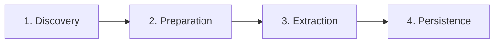

# CLAUDE.md

This file provides guidance to Claude Code (claude.ai/code) when working with code in this repository.

## Project Overview

AutoNyan is a Google Cloud Functions project built with TypeScript and managed with Terraform. The project demonstrates an event-driven, serverless document processing pipeline featuring Google Drive integration, Vision API text extraction, Firestore data persistence, and automated CI/CD workflows.

## Architecture & Pipeline

### Event-Driven Architecture

AutoNyan implements a 4-stage event-driven pipeline:



**Pipeline:** Cloud Scheduler → Drive scan → Document prep → Vision API → Firestore

**Pipeline Flow:**

1. **Drive Discovery**: Scans Google Drive folders on schedule, discovers documents
2. **Document Preparation**: Downloads files from Drive, copies to Cloud Storage
3. **Text Extraction**: Processes documents with Vision API for OCR
4. **Data Persistence**: Stores extracted text and metadata in Firestore

**Event Trigger Types:**

- **Scheduled**: Cloud Scheduler triggers periodic scans (Stage 1)
- **PubSub**: Message-based triggers between discovery and preparation (Stages 1→2)
- **Storage**: Object finalization events trigger processing (Stages 2→3, 3→4)

**Key Architectural Principles:**

- **Asynchronous**: All stages communicate via events, not direct calls
- **Loosely Coupled**: Functions can be deployed, scaled, and updated independently
- **Reliable**: Automatic retry policies on all event triggers
- **Scalable**: Auto-scaling from 0 to configured maximum instances

### Code Organization

**Workspace Structure:**
```
src/
├── functions/          # npm workspaces - one per Cloud Function
│   ├── drive-scanner/
│   ├── doc-processor/
│   ├── text-vision-processor/
│   └── text-firebase-writer/
└── shared/            # Shared utilities library
```

**Each function workspace contains:**
- `index.ts` - CloudEvent handler implementation
- `index.test.ts` - Unit tests with mocked GCP services
- `package.json` - Dependencies and scripts
- `tsconfig.json` - TypeScript configuration

**Shared library (`src/shared`) provides:**
- CloudEvent parameter parsing
- Input validation utilities
- Common error handling patterns
- TypeScript types for events

**Infrastructure mirrors code structure:**
```
terraform/
├── modules/           # One module per Cloud Function
│   ├── drive-scanner/
│   ├── doc-processor/
│   ├── text-vision-processor/
│   └── text-firebase-writer/
└── main.tf           # Orchestrates modules
```

## Common Commands

Commands are organized by workflow. See `package.json` for the complete list.

### Build & Test Workflow
```bash
npm run build              # Build all function workspaces
npm test                   # Run all tests
npm run test:coverage      # Run with coverage thresholds
npm run clean              # Remove build artifacts
```

### Code Quality Workflow
```bash
npm run lint               # Lint all code (TypeScript, YAML, Terraform, JSON, Shell)
npm run format             # Format all code with Prettier/terraform fmt
npm run lint:ts            # TypeScript-specific linting
npm run lint:terraform     # Terraform validation and linting
```

### Infrastructure Workflow
```bash
npm run terraform:init     # Initialize backend (first time or after changes)
npm run terraform:plan     # Preview infrastructure changes
npm run terraform:apply    # Apply changes to GCP
npm run terraform:validate # Validate configuration without backend
npm run terraform:destroy  # Destroy all infrastructure (caution)
```

### Deployment Workflow
```bash
npm run deploy             # Full deployment: build + terraform apply
```

### Setup Workflow
```bash
npm run setup:terraform-backend  # Create GCS bucket for Terraform state
npm run setup:github-actions     # Configure Workload Identity Federation
npm run setup:terraform-variables # Interactive variable configuration
```

## Development Patterns

### CloudEvent Handler Pattern

All Cloud Functions use CloudEvent handlers (not HTTP handlers):

```typescript
import { CloudEvent } from '@google-cloud/functions-framework';
import { MessagePublishedData } from '@google/events/cloud/pubsub/v1/MessagePublishedData';

interface MyEventData extends Record<string, unknown> {
  requiredField: string;
  optionalField?: string;
}

export const myFunction = async (
  cloudEvent: CloudEvent<MessagePublishedData>
): Promise<Result> => {
  // Parse PubSub event data
  const { data: messageData } = parsePubSubEvent<MyEventData>(cloudEvent);

  // Validate required fields
  validateRequiredFields(messageData, ['requiredField']);

  // Business logic here

  return {
    message: 'Success',
    // ...other result fields
  };
};
```

**For Storage-triggered functions:**

```typescript
import { CloudEvent } from '@google-cloud/functions-framework';
import { StorageObjectData } from '@google/events/cloud/storage/v1/StorageObjectData';

export const myStorageFunction = async (
  cloudEvent: CloudEvent<StorageObjectData>
): Promise<Result> => {
  const file = cloudEvent.data;
  const bucketName = file.bucket;
  const fileName = file.name;

  // Process the file
};
```

### Shared Utilities Pattern

Use the shared library for common operations:

```typescript
import {
  parsePubSubEvent,
  validateRequiredFields,
  createErrorResponse,
  ValidationError,
  ParameterParsingError,
} from 'autonyan-shared';

// Parse PubSub CloudEvent to typed data
const { data, attributes } = parsePubSubEvent<MyDataType>(cloudEvent);

// Validate required fields (throws ValidationError if missing)
validateRequiredFields(data, ['field1', 'field2']);

// Create error responses
try {
  // ...
} catch (error) {
  throw createErrorResponse('Operation failed', error);
}
```

### Testing Pattern

**Test structure:**
- Mock all Google Cloud services (Drive API, Storage, PubSub, Vision API)
- Create CloudEvent test fixtures
- Test both success and error paths
- Maintain coverage thresholds (enforced in CI)

**Example test pattern:**

```typescript
import { CloudEvent } from '@google-cloud/functions-framework';

describe('myFunction', () => {
  it('should process valid event', async () => {
    // Create mock CloudEvent
    const cloudEvent: CloudEvent<MessagePublishedData> = {
      // ...CloudEvent structure
      data: {
        message: {
          data: Buffer.from(JSON.stringify({ requiredField: 'value' })).toString('base64'),
        },
      },
    };

    // Execute function
    const result = await myFunction(cloudEvent);

    // Assert results
    expect(result.message).toBe('Success');
  });

  it('should handle missing required fields', async () => {
    // Test with invalid data
    // Expect ValidationError
  });
});
```

### Terraform Module Pattern

Each function has a corresponding Terraform module:

```hcl
# Module structure (terraform/modules/my-function/)
# - main.tf (function, service account, IAM, triggers)
# - variables.tf (inputs from parent)
# - outputs.tf (values for other modules)

# Service account with least privilege
resource "google_service_account" "my_function_sa" {
  account_id   = "my-function-sa"
  display_name = "My Function Service Account"
}

# Cloud Function with event trigger
resource "google_cloudfunctions2_function" "my_function" {
  name     = "my-function"
  location = var.region

  build_config {
    runtime     = "nodejs20"
    entry_point = "myFunction"  # Must match the actual exported function name in the implementation
    source {
      storage_source {
        bucket = var.function_bucket_name
        object = google_storage_bucket_object.my_function_zip.name
      }
    }
  }

  service_config {
    service_account_email = google_service_account.my_function_sa.email
    # Memory, timeout, env vars...
  }

  event_trigger {
    # PubSub or Storage event configuration
  }
}
```

## Development Workflows

### Feature Development Workflow

1. **Create feature branch** (never develop on master)
   ```bash
   git checkout -b feature/description
   ```

2. **Make changes** to code or infrastructure

3. **Run quality checks** before committing
   ```bash
   npm run lint
   npm run format
   npm test
   ```

4. **Commit changes** with descriptive message
   ```bash
   git add .
   git commit -m "feat: add feature description"
   ```

5. **Push and create PR**
   ```bash
   git push -u origin feature/description
   ```

6. **Automated checks run** in GitHub Actions (linting, tests, Terraform plan for owner PRs)

7. **Review and merge** after approval

### Adding a New Function Workflow

1. **Create function workspace**
   - Create `src/functions/new-function/` directory
   - Set up `package.json`, `tsconfig.json`, `jest.config.js` (copy from existing function)
   - Add workspace to root `package.json` (auto-discovered via `src/functions/*` pattern)

2. **Implement CloudEvent handler**
   - Create `index.ts` with exported function
   - Use shared utilities for parsing and validation
   - Follow existing patterns for GCP service integration

3. **Write tests**
   - Create `index.test.ts` with comprehensive coverage
   - Mock all external services
   - Test success paths and error handling

4. **Create Terraform module**
   - Create `terraform/modules/new-function/` directory
   - Define service account, IAM roles, Cloud Function resource
   - Configure event trigger (PubSub or Storage)
   - Add required infrastructure (topics, buckets, etc.)

5. **Wire up in main configuration**
   - Add module block to `terraform/main.tf`
   - Connect to pipeline via event triggers
   - Add to build script if needed

6. **Update CI workflow**
   - Add new function to matrix in `.github/workflows/test.yml`
   - Update both `lint-functions` and `test-functions` job matrices
   - Example:
     ```yaml
     strategy:
       matrix:
         function:
           [
             doc-processor,
             drive-scanner,
             file-classifier,  # Add new function here
             text-firebase-writer,
             text-vision-processor,
           ]
     ```

7. **Test locally**
   ```bash
   npm run build
   npm test --workspace=src/functions/new-function
   npm run terraform:plan  # Review infrastructure changes
   ```

8. **Deploy**
   ```bash
   npm run deploy
   ```

### Infrastructure Change Workflow

1. **Modify Terraform files** in `terraform/` or `terraform/modules/`

2. **Validate configuration**
   ```bash
   npm run terraform:validate
   npm run lint:terraform
   ```

3. **Preview changes**
   ```bash
   npm run terraform:plan
   ```

4. **Review plan output carefully**
   - Check for unexpected resource changes
   - Verify no data loss (e.g., storage buckets with `force_destroy = false`)
   - Ensure IAM changes follow least privilege

5. **Apply changes**
   ```bash
   npm run terraform:apply
   ```

6. **Verify in Google Cloud Console**
   - Check deployed resources
   - View function logs
   - Test triggers manually

### Debugging Workflow

**Local debugging:**
- Use `console.log()` for debugging (removed in production via tree shaking)
- Run functions locally with test events
- Mock GCP services for isolated testing

**Cloud debugging:**
```bash
# View recent logs
gcloud functions logs read FUNCTION_NAME --region=REGION --limit=50

# Stream logs in real-time
gcloud functions logs read FUNCTION_NAME --region=REGION --follow

# Filter logs by severity
gcloud functions logs read FUNCTION_NAME --region=REGION --filter="severity>=ERROR"
```

**Common debugging scenarios:**
- **Function timeout**: Check timeout configuration in Terraform module
- **Permission errors**: Verify service account IAM roles in module
- **Event not triggering**: Check event trigger configuration and PubSub/Storage permissions
- **Module not found**: Verify npm workspace configuration and build output

## Infrastructure Patterns

### Terraform Backend Pattern

**Remote state in Cloud Storage:**
- State bucket created via `npm run setup:terraform-backend`
- Backend configured in `terraform/backend.tf`
- State locking prevents concurrent modifications
- Shared state enables team collaboration

### Service Account Pattern

**Least privilege per function:**
- Each function has dedicated service account
- IAM roles granted only for required operations
- Drive access via manual folder sharing (not project-level IAM)
- Storage access scoped to specific buckets

**Example IAM pattern:**
```hcl
# Storage read access
resource "google_project_iam_member" "function_storage_viewer" {
  project = var.project_id
  role    = "roles/storage.objectViewer"
  member  = "serviceAccount:${google_service_account.function_sa.email}"
}

# PubSub publish access
resource "google_project_iam_member" "function_pubsub_publisher" {
  project = var.project_id
  role    = "roles/pubsub.publisher"
  member  = "serviceAccount:${google_service_account.function_sa.email}"
}
```

### Resource Naming Convention

**Consistent naming across resources:**
- Functions: `{stage-name}` (e.g., `drive-scanner`, `doc-processor`)
- Service Accounts: `{function-name}-sa`
- PubSub Topics: `{function-name}-trigger` or `{purpose}-trigger`
- Storage Buckets: `{project-id}-{purpose}`
- Terraform Modules: Match function names

### Environment Variables Pattern

Functions receive configuration via environment variables set in Terraform:

```hcl
service_config {
  environment_variables = {
    NODE_ENV   = "production"
    PROJECT_ID = var.project_id
    TOPIC_NAME = var.next_stage_topic_name
  }
}
```

Access in code via `process.env`:
```typescript
const topicName = process.env.TOPIC_NAME || 'default-topic';
```

## GitHub Actions CI/CD Pipeline

### Pipeline Security Model

**Workload Identity Federation:**
- No service account keys stored in GitHub
- GitHub Actions authenticates via identity federation
- Configured via `npm run setup:github-actions`

**PR Author-Based Permissions:**
- **Repository Owner PRs**: Full pipeline access (test → plan → build)
- **Dependabot PRs**: Auto-triggered with smart detection (skips Terraform if only docs/workflows changed)
- **External PRs**: Testing only (no infrastructure access)
- **Manual Override**: Comment `/terraform plan` to trigger infrastructure validation (owners only)

### Pipeline Stages

**Stage 1: Test Workflow**
- Runs on all PRs and pushes to master
- Linting (TypeScript, YAML, Terraform, JSON, Shell)
- Unit tests with coverage thresholds
- Formatting checks

**Stage 2: Terraform Plan Workflow**
- Auto-triggered after Test success (for owner/Dependabot PRs)
- Smart detection: skips if only non-infrastructure files changed
- Validates Terraform configuration
- Posts plan output as PR comment (if applicable)

**Stage 3: Build Workflow**
- Auto-triggered after Terraform Plan success
- Builds function deployment packages
- Creates zip archives for Cloud Functions

**Stage 4: Deploy**
- Manual only (not automated in GitHub Actions)
- Use `npm run deploy` locally or via release automation

### Smart Detection Logic

Terraform plan automatically skips when PR only changes:
- Documentation files (`*.md`)
- GitHub workflow files (`.github/workflows/`)
- IDE configuration files (`.vscode/`, `.devcontainer/`)
- Non-infrastructure files

This prevents unnecessary Terraform runs for Dependabot updates to dev dependencies or workflow improvements.

### Debugging CI/CD Workflows

When CI tests fail or you need to investigate GitHub Actions execution, use the WebFetch tool to retrieve CI results and logs directly from Claude Code on the Web.

**Accessing CI Results:**

Use WebFetch with PR or Actions URLs to view CI status:

```
WebFetch URL: https://github.com/{owner}/{repo}/pull/{pr_number}
Prompt: "Extract all CI check results, job names, and their status (success/failure)"

WebFetch URL: https://github.com/{owner}/{repo}/actions/runs/{run_id}
Prompt: "Extract detailed job results, failure messages, and which steps failed"
```

**Common CI Debugging Patterns:**

1. **Check PR CI Status**
   ```
   URL: https://github.com/{owner}/{repo}/pull/{pr_number}/checks
   Prompt: "List all checks with their status and identify failed jobs"
   ```

2. **View Specific Workflow Run**
   ```
   URL: https://github.com/{owner}/{repo}/actions/runs/{run_id}
   Prompt: "Show job statuses, error messages, and which matrix jobs failed"
   ```

3. **Find Latest Runs for Branch**
   ```
   URL: https://github.com/{owner}/{repo}/actions
   Prompt: "Find the latest Test workflow runs for branch X and their status"
   ```

**Direct GitHub API Access:**

When WebFetch is not suitable (e.g., downloading binary log archives), use direct GitHub API access with curl:

```bash
# Download workflow run logs as ZIP archive
# IMPORTANT: Use "token" prefix, not "Bearer"
curl -L -H "Authorization: token ${GITHUB_TOKEN}" \
  "https://api.github.com/repos/{owner}/{repo}/actions/runs/{run_id}/logs" \
  -o logs.zip

# Extract specific log file from archive
unzip -p logs.zip "*{job-name}*" | grep -E "(FAIL|Error|heap out of memory)"
```

**Common authentication mistake:**
- ❌ `Authorization: Bearer ${GITHUB_TOKEN}` → Results in 401 "Bad credentials"
- ✅ `Authorization: token ${GITHUB_TOKEN}` → Correct format for GitHub API

**Troubleshooting CI Failures:**

- **Test failures**: Check which specific test jobs (matrix) failed
- **Coverage failures**: Verify coverage thresholds are met locally first
- **Codecov issues**: Ensure Codecov repository is activated (not deactivated)
- **Memory errors**: Check for out-of-memory errors in test jobs
- **Isolated failures**: If tests pass locally but fail in CI, investigate environment-specific issues

**Best Practices:**

- Always verify tests pass locally before pushing
- Use WebFetch to retrieve full CI logs when debugging
- Check both job-level and step-level failures
- Look for patterns across multiple workflow runs
- Verify external services (like Codecov) are properly configured

## Google Drive Integration

### Service Account Pattern

**Manual folder sharing required:**
- Drive API doesn't support project-level IAM
- Service account must be explicitly granted access to folders
- Ensures least-privilege access (only shared folders accessible)

**Setup workflow:**
1. Deploy infrastructure: `npm run deploy`
2. Get service account email: `terraform output service_account_email`
3. Share Drive folder(s) with service account as "Editor"
4. Test access via manual PubSub trigger

**Permission model:**
- ✅ Can access: Explicitly shared folders and files
- ✅ Can perform: List, read, create folders, move/copy files
- ❌ Cannot access: Unshared folders, other users' private content
- ❌ Cannot perform: Delete files, modify permissions

### Supported Operations

Functions using Drive API can perform:
- List files with pagination (handles folders with hundreds of files)
- Search files by name and MIME type
- Read file metadata (name, size, modified time, MIME type)
- Download file content
- Create folders in shared areas
- Move files between shared folders
- Copy files within shared areas

### Manual Trigger Pattern

Trigger pipeline manually via PubSub:

```bash
# Get topic name from Terraform outputs
terraform output

# Publish trigger message
gcloud pubsub topics publish <TOPIC_NAME> --message='{"folderId":"FOLDER_ID"}'
```

## Git Workflow Rules

### Branch Management

**Branch naming conventions:**
- Features: `feature/description` or `feat/description`
- Bug fixes: `fix/description` or `bugfix/description`
- Documentation: `docs/description`
- Refactoring: `refactor/description`

**Branch rules:**
- ⛔ Never develop directly on master branch
- ✅ Always create feature/fix branches
- ✅ Delete branches after merging
- ✅ Keep branches short-lived and focused

### Pre-Commit Requirements

**Quality gates before every commit:**

1. **Run linters and formatters:**
   ```bash
   npm run lint
   npm run format
   ```

2. **Verify all checks pass** (no linting errors, no formatting issues)

3. **Run tests:**
   ```bash
   npm test
   ```

4. **Review changed files** before staging

### Commit Message Convention

Follow conventional commit format:

```
<type>: <description>

[optional body]
```

**Types:**
- `feat`: New feature
- `fix`: Bug fix
- `refactor`: Code refactoring without behavior change
- `test`: Adding or updating tests
- `docs`: Documentation changes
- `chore`: Maintenance tasks (dependencies, config)
- `ci`: CI/CD pipeline changes

**Examples:**
- `feat: add Vision API text extraction`
- `fix: handle pagination for large Drive folders`
- `refactor: extract common validation logic to shared library`
- `docs: update architecture diagram in README`

### Recommended Workflow

```bash
# 1. Create and switch to new branch
git checkout -b feature/your-feature-name

# 2. Make your changes
# ... develop your feature ...

# 3. Run quality checks before committing
npm run lint
npm run format
npm test

# 4. Stage and commit changes
git add .
git commit -m "feat: add your feature description"

# 5. Push branch and create PR
git push -u origin feature/your-feature-name
```

## Key Principles for AI Assistance

When working with this codebase:

1. **Follow existing patterns**: Match the style and structure of existing functions
2. **Use shared utilities**: Don't reimplement parsing, validation, or error handling
3. **Maintain type safety**: All code must pass TypeScript strict mode
4. **Test comprehensively**: Write tests for both success and error paths
5. **Document infrastructure**: Add comments to Terraform resources explaining their purpose
6. **Respect module boundaries**: Keep function code independent, use events for communication
7. **Follow least privilege**: Grant only necessary IAM permissions to service accounts
8. **Validate inputs**: Always validate CloudEvent data before processing
9. **Handle errors gracefully**: Use try-catch and shared error utilities
10. **Check coverage**: Ensure tests meet coverage thresholds before committing

## Maintaining This Document

**When to update CLAUDE.md:**

- ✅ **New architectural patterns**: When introducing new design patterns or code organization approaches
- ✅ **Workflow changes**: When development workflows or processes change significantly
- ✅ **Infrastructure patterns**: When adding new Terraform patterns or IAM strategies
- ✅ **Code patterns**: When establishing new shared utilities or testing approaches
- ✅ **CI/CD updates**: When pipeline stages or security model changes

**What NOT to update:**

- ❌ **Specific function names**: Use generic examples (e.g., `myFunction` instead of `driveScanner`)
- ❌ **Exact file paths**: Use patterns (e.g., `src/functions/*/index.ts`)
- ❌ **Line numbers**: Never reference specific line numbers
- ❌ **Exact resource names**: Use placeholders or naming conventions instead
- ❌ **Version-specific details**: Keep examples version-agnostic

**Maintenance principle:** Document patterns and workflows, not implementations. AI assistants should discover current implementations from code, not from documentation.

**Update trigger:** When you add a new function or change infrastructure, update the pattern sections only if the new code introduces a **new pattern** not already documented. If it follows existing patterns, no documentation update is needed.

## Quick Reference

**Find available npm scripts:** `cat package.json | grep "scripts" -A 30`

**Find Terraform resources:** `grep -r "resource \"google_" terraform/`

**Find function entry points:** `grep -r "export const" src/functions/*/index.ts`

**Check workspace configuration:** `npm ls --workspaces`

**View Terraform outputs:** `terraform -chdir=terraform output`

**Trigger manual test:** Check Terraform outputs for PubSub topic names, then use `gcloud pubsub topics publish`
