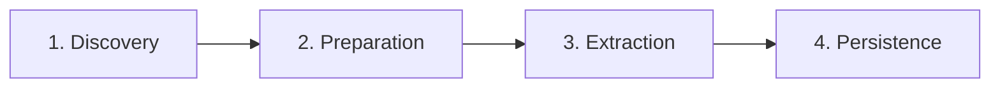

# CLAUDE.md

This file provides guidance to Claude Code (claude.ai/code) when working with code in this repository.

## Project Overview

AutoNyan is a Google Cloud Functions project built with TypeScript and managed with Terraform. The project demonstrates an event-driven, serverless document processing pipeline featuring Google Drive integration, Vision API text extraction, Firestore data persistence, and automated CI/CD workflows.

## Architecture & Pipeline

### Event-Driven Architecture

AutoNyan implements a 4-stage event-driven pipeline:


```mermaid
graph LR
    A[1. Discovery] --> B[2. Preparation]
    B --> C[3. Extraction]
    C --> D[4. Persistence]
```

**Pipeline:** Cloud Scheduler → Drive scan → Document prep → Vision API → Firestore

**Pipeline Flow:**

1. **Drive Discovery**: Scans Google Drive folders on schedule, discovers documents
2. **Document Preparation**: Downloads files from Drive, copies to Cloud Storage
3. **Text Extraction**: Processes documents with Vision API for OCR
4. **Data Persistence**: Stores extracted text and metadata in Firestore

**Event Trigger Types:**

- **Scheduled**: Cloud Scheduler triggers periodic scans (Stage 1)
- **PubSub**: Message-based triggers between discovery and preparation (Stages 1→2)
- **Storage**: Object finalization events trigger processing (Stages 2→3, 3→4)

**Key Architectural Principles:**

- **Asynchronous**: All stages communicate via events, not direct calls
- **Loosely Coupled**: Functions can be deployed, scaled, and updated independently
- **Reliable**: Automatic retry policies on all event triggers
- **Scalable**: Auto-scaling from 0 to configured maximum instances

### Code Organization

**Workspace Structure:**
```
src/
├── functions/          # npm workspaces - one per Cloud Function
│   ├── drive-scanner/
│   ├── doc-processor/
│   ├── text-vision-processor/
│   └── text-firebase-writer/
└── shared/            # Shared utilities library
```

**Each function workspace contains:**
- `index.ts` - CloudEvent handler implementation
- `index.test.ts` - Unit tests with mocked GCP services
- `package.json` - Dependencies and scripts
- `tsconfig.json` - TypeScript configuration

**Shared library (`src/shared`) provides:**
- CloudEvent parameter parsing
- Input validation utilities
- Common error handling patterns
- TypeScript types for events

**Infrastructure mirrors code structure:**
```
terraform/
├── modules/           # One module per Cloud Function
│   ├── drive-scanner/
│   ├── doc-processor/
│   ├── text-vision-processor/
│   └── text-firebase-writer/
└── main.tf           # Orchestrates modules
```

## Common Commands

Commands are organized by workflow. See `package.json` for the complete list.

### Build & Test Workflow
```bash
npm run build              # Build all function workspaces
npm test                   # Run all tests
npm run test:coverage      # Run with coverage thresholds
npm run clean              # Remove build artifacts
```

### Code Quality Workflow
```bash
npm run lint               # Lint all code (TypeScript, YAML, Terraform, JSON, Shell)
npm run format             # Format all code with Prettier/terraform fmt
npm run lint:ts            # TypeScript-specific linting
npm run lint:terraform     # Terraform validation and linting
```

### Infrastructure Workflow
```bash
# Set environment (staging is default)
export ENVIRONMENT=staging  # or 'production'

npm run terraform:init     # Initialize backend (-reconfigure switches environments automatically)
npm run terraform:plan     # Preview infrastructure changes
npm run terraform:apply    # Apply changes to GCP
npm run terraform:validate # Validate configuration without backend
npm run terraform:destroy  # Destroy all infrastructure (caution)
```

Each command reads `terraform/environments/${ENVIRONMENT}.tfvars` (gitignored).
Create this file from `terraform/terraform.tfvars.example` for each environment.

### Deployment Workflow
```bash
npm run deploy             # Full deployment: build + terraform apply
```

### Setup Workflow
```bash
npm run setup:terraform-backend    # Create GCS bucket for Terraform state
npm run setup:github-actions       # Configure Workload Identity Federation
npm run setup:terraform-variables  # Interactive variable configuration
npm run setup:share-drive-folders  # Share Drive folders with service accounts (post-deployment)
```

## Development Patterns

### CloudEvent Handler Pattern

All Cloud Functions use CloudEvent handlers (not HTTP handlers):

```typescript
import { CloudEvent } from '@google-cloud/functions-framework';
import { MessagePublishedData } from '@google/events/cloud/pubsub/v1/MessagePublishedData';

interface MyEventData extends Record<string, unknown> {
  requiredField: string;
  optionalField?: string;
}

export const myFunction = async (
  cloudEvent: CloudEvent<MessagePublishedData>
): Promise<Result> => {
  // Parse PubSub event data
  const { data: messageData } = parsePubSubEvent<MyEventData>(cloudEvent);

  // Validate required fields
  validateRequiredFields(messageData, ['requiredField']);

  // Business logic here

  return {
    message: 'Success',
    // ...other result fields
  };
};
```

**For Storage-triggered functions:**

```typescript
import { CloudEvent } from '@google-cloud/functions-framework';
import { StorageObjectData } from '@google/events/cloud/storage/v1/StorageObjectData';

export const myStorageFunction = async (
  cloudEvent: CloudEvent<StorageObjectData>
): Promise<Result> => {
  const file = cloudEvent.data;
  const bucketName = file.bucket;
  const fileName = file.name;

  // Process the file
};
```

### Shared Utilities Pattern

Use the shared library for common operations:

```typescript
import {
  parsePubSubEvent,
  validateRequiredFields,
  createErrorResponse,
  ValidationError,
  ParameterParsingError,
} from 'autonyan-shared';

// Parse PubSub CloudEvent to typed data
const { data, attributes } = parsePubSubEvent<MyDataType>(cloudEvent);

// Validate required fields (throws ValidationError if missing)
validateRequiredFields(data, ['field1', 'field2']);

// Create error responses
try {
  // ...
} catch (error) {
  throw createErrorResponse('Operation failed', error);
}
```

### Testing Pattern

**Test structure:**
- Mock all Google Cloud services (Drive API, Storage, PubSub, Vision API)
- Create CloudEvent test fixtures
- Test both success and error paths
- Maintain coverage thresholds (enforced in CI)

**Example test pattern:**

```typescript
import { CloudEvent } from '@google-cloud/functions-framework';

describe('myFunction', () => {
  it('should process valid event', async () => {
    // Create mock CloudEvent
    const cloudEvent: CloudEvent<MessagePublishedData> = {
      // ...CloudEvent structure
      data: {
        message: {
          data: Buffer.from(JSON.stringify({ requiredField: 'value' })).toString('base64'),
        },
      },
    };

    // Execute function
    const result = await myFunction(cloudEvent);

    // Assert results
    expect(result.message).toBe('Success');
  });

  it('should handle missing required fields', async () => {
    // Test with invalid data
    // Expect ValidationError
  });
});
```

### Terraform Module Pattern

Each function has a corresponding Terraform module:

```hcl
# Module structure (terraform/modules/my-function/)
# - main.tf (function, service account, IAM, triggers)
# - variables.tf (inputs from parent)
# - outputs.tf (values for other modules)

# Service account with least privilege
resource "google_service_account" "my_function_sa" {
  account_id   = "my-function-sa"
  display_name = "My Function Service Account"
}

# Cloud Function with event trigger
resource "google_cloudfunctions2_function" "my_function" {
  name     = "my-function"
  location = var.region

  build_config {
    runtime     = "nodejs20"
    entry_point = "myFunction"  # Must match the actual exported function name in the implementation
    source {
      storage_source {
        bucket = var.function_bucket_name
        object = google_storage_bucket_object.my_function_zip.name
      }
    }
  }

  service_config {
    service_account_email = google_service_account.my_function_sa.email
    # Memory, timeout, env vars...
  }

  event_trigger {
    # PubSub or Storage event configuration
  }
}
```

### Comment Policy

Comments (in code, Terraform, and CI workflows) follow these project rules:

- **Explain "why", not "what".** A comment that restates what the next line
  obviously does is removed. Keep comments that capture rationale a reader
  cannot recover from the code — a non-obvious decision, constraint, or
  footgun.
- **No redundant comments.** Drop any comment that duplicates an adjacent
  `echo`/log line, a self-documenting variable name, or text already written
  in this document.
- **Single source of truth for rationale.** Document a design rationale in
  exactly one place — usually this `CLAUDE.md` — and have the code carry only
  a short pointer or a local warning, never a second copy that must be kept in
  sync.
- **Keep-or-remove judgment.** When deciding whether a comment earns its place,
  weigh its maintenance cost (concrete names — file paths, patterns, resource
  names — drift and go stale) against its benefit (readability and preventing a
  future maintainer from making a breaking change). Keep it only when the
  benefit clearly wins.

## Development Workflows

These workflows are implemented as skills under `.claude/skills/`. Invoke the
skill rather than following steps by hand — each skill discovers the current
repo layout and keeps the procedure in one place. The notes below capture only
the knowledge a skill cannot rediscover.

### Feature Development

Work on a `feature/` or `fix/` branch, never on master. The end-to-end loop is a
chain of skills: make changes → `quality-gate` (lint, format check,
coverage-gated tests) → `commit` → `create-pr`. The branch, commit, and PR
conventions those skills enforce are in the Git Workflow Rules below.

### Adding a New Function

Use the `add-function` skill — it scaffolds the `src/functions/<name>/` npm
workspace, the `terraform/modules/<name>/` module, the `terraform/main.tf`
wiring, and **both** CI matrices in `.github/workflows/test.yml`. The pipeline is
event-driven, so a new stage becomes reachable only once its event trigger is
wired to the upstream/downstream topic or bucket (see Architecture above).

### Infrastructure Change

Edit Terraform under `terraform/`, then review with the `terraform-plan-review`
skill before applying. The review must catch unexpected resource changes, data
loss (e.g. a bucket with `force_destroy = false` being replaced), and IAM that
violates least privilege. Applying to staging is the `deploy-staging` skill;
production deploys via a version tag (see CI/CD Pipeline below). Never
`terraform apply` without reviewing the plan first.

### Debugging

**Local:** function source logs via the shared structured logger
(`src/shared/logger.ts`), not bare `console.*` (enforced by `no-console:
error`). The logger writes one JSON line per entry to stdout/stderr, which the
Cloud Functions runtime forwards to Cloud Logging; nothing is stripped at build
time (the build is plain `tsc`). Run functions against test events with all GCP
services mocked.

**Deployed function:** use the `debug-function-logs` skill — it reads logs with
`gcloud` and maps findings to the common failure modes (timeout → module
config, permission error → service-account IAM, event not triggering →
trigger / PubSub-Storage permissions, module not found → workspace build
output).

**CI failures:** use the `debug-ci` skill.

## Infrastructure Patterns

### Terraform Backend Pattern

**Remote state in Cloud Storage:**
- State bucket created via `npm run setup:terraform-backend`
- Backend configured in `terraform/backend.tf`
- State locking prevents concurrent modifications
- Shared state enables team collaboration

### Service Account Pattern

**Least privilege per function:**
- Each function has dedicated service account
- IAM roles granted only for required operations
- Drive access via manual folder sharing (not project-level IAM)
- Storage access scoped to specific buckets

**Example IAM pattern:**
```hcl
# Storage read access
resource "google_project_iam_member" "function_storage_viewer" {
  project = var.project_id
  role    = "roles/storage.objectViewer"
  member  = "serviceAccount:${google_service_account.function_sa.email}"
}

# PubSub publish access
resource "google_project_iam_member" "function_pubsub_publisher" {
  project = var.project_id
  role    = "roles/pubsub.publisher"
  member  = "serviceAccount:${google_service_account.function_sa.email}"
}
```

### Multi-Environment Pattern

**Staging and Production environments:**
- Resources are prefixed with environment name (e.g., `staging-drive-scanner`, `production-drive-scanner`)
- Separate Terraform state files per environment (`terraform/state/staging/`, `terraform/state/production/`)
- Environment Secrets in GitHub: same secret names (`DRIVE_FOLDER_ID`, etc.) defined in each Environment
- Allows independent deployment and testing

**GitHub Environment Secrets setup:**
Each environment (`staging`, `production`) should have these secrets with the same names:
- `DRIVE_FOLDER_ID` - Google Drive folder to scan
- `CATEGORY_ROOT_FOLDER_ID` - Root folder for categorized files
- `UNCATEGORIZED_FOLDER_ID` - Folder for uncategorized files
- `BILLING_ACCOUNT_ID` - Cloud Billing account ID (format: XXXXXX-XXXXXX-XXXXXX)
- `NOTIFICATION_FROM_EMAIL` - Sender email address for processing notifications

**Environment variable in Terraform:**
```hcl
variable "environment" {
  description = "Deployment environment (staging or production)"
  type        = string
  validation {
    condition     = contains(["staging", "production"], var.environment)
    error_message = "Environment must be either 'staging' or 'production'."
  }
}
```

### Resource Naming Convention

**Consistent naming across resources:**
- Functions: `{environment}-{stage-name}` (e.g., `staging-drive-scanner`, `production-doc-processor`)
- Service Accounts: `{environment}-{function-name}-sa`
- PubSub Topics: `{environment}-{function-name}-trigger`
- Storage Buckets: `{project-id}-{environment}-{purpose}`
- Terraform Modules: Match function names (environment passed as variable)

### Environment Variables Pattern

Functions receive configuration via environment variables set in Terraform:

```hcl
service_config {
  environment_variables = {
    NODE_ENV   = "production"
    PROJECT_ID = var.project_id
    TOPIC_NAME = var.next_stage_topic_name
  }
}
```

Access in code via `process.env`:
```typescript
const topicName = process.env.TOPIC_NAME || 'default-topic';
```

## GitHub Actions CI/CD Pipeline

### Pipeline Security Model

**Workload Identity Federation:**
- No service account keys stored in GitHub
- GitHub Actions authenticates via identity federation
- Configured via `npm run setup:github-actions`

**PR Author-Based Permissions:**
- **Repository Owner PRs**: Full pipeline access (test → plan → build)
- **Renovate PRs**: Auto-triggered with smart detection (skips Terraform if only docs/workflows changed)
  - Renovate uses GitHub App token generated via `actions/create-github-app-token`
  - PRs are created by the GitHub App bot user
- **External PRs**: Testing only (no infrastructure access)
- **Manual Override**: Comment `/terraform plan` to trigger infrastructure validation (owners only)

### Pipeline Stages

**Stage 1: Test Workflow**
- Runs on all PRs and pushes to master
- Linting (TypeScript, YAML, Terraform, JSON, Shell)
- Unit tests with coverage thresholds
- Formatting checks

**Stage 2: Terraform Plan Workflow (Staging)**
- Auto-triggered after Test success (for owner/Renovate PRs)
- Plans against **staging** environment
- Smart detection: skips if only non-infrastructure files changed
- Validates Terraform configuration
- Posts plan output as PR comment (if applicable)

**Stage 3: Build Workflow**
- Auto-triggered after Terraform Plan success
- Builds function deployment packages
- Creates zip archives for Cloud Functions

**Stage 4: Deploy to Staging**
- Auto-triggered after successful Terraform Plan on master branch
- Deploys to **staging** environment
- Uses staging Environment Secrets

**Stage 5: Deploy to Production**
- Triggered by version tag push (e.g., `v1.0.0`)
- Deploys to **production** environment
- Uses production Environment Secrets
- Semver format required: `v<major>.<minor>.<patch>`

**Note:** Stages 4 and 5 use a unified Deploy workflow (`deploy.yml`) with environment-based configuration.

**Deployment Flow:**
```
PR → Test → Terraform Plan (staging)
         ↓
master merge → Deploy to Staging
         ↓
git tag v1.0.0 → Deploy to Production
```

### Smart Detection Logic

Both the Test workflow (`test.yml`) and the Terraform Plan workflow (`terraform-plan.yml`) skip unnecessary work when a PR only touches code-unrelated files (docs, skills, IDE config), so Renovate dev-dependency bumps and skill/docs edits do not run the full lint/test matrix or Terraform plan.

The exact detection rules live in the workflows' change-detection steps — Test in its `detect-changes` job, Terraform Plan in its detect step — and the comments there explain why each workflow scopes "relevant" differently. Treat those steps as the source of truth rather than restating the patterns here.

### Required Status Check Invariant

**Every required status check in the `master` ruleset must be reported for all PRs the ruleset applies to — including code-unrelated ones.** A skip path (smart detection, gating, or any conditional that prevents a job from running) must still post a terminal status for each required check; it must never leave a required check perpetually pending, or the PR is stuck `BLOCKED` even when all jobs that ran are green.

The ruleset requires two contexts, each reported by a distinct workflow:

- **`test`** — reported by the aggregation `test` job in `.github/workflows/test.yml`. It runs with `if: always()` and reports success even when the lint/test matrix was skipped for a code-unrelated PR.
- **`terraform/plan/staging`** — reported by the "Set final status" step in `.github/workflows/terraform-plan.yml`. That workflow self-skips the actual plan for no-infrastructure PRs but still posts `success`. For PRs it is dispatched by the `trigger-terraform-plan` job in `test.yml`, which therefore must still fire when `test` succeeded even if the matrix was skipped.

This was the regression in #344: a skip cascade left `terraform/plan/staging` unreported on code-unrelated PRs. When changing the skip/gating graph, preserve this invariant for both contexts.

### Debugging CI/CD Workflows

Use the `debug-ci` skill to investigate a red check. It resolves the target PR
or run, drills into the failed jobs and matrix entries with `gh`, extracts the
relevant log excerpt, and reports a diagnosis. When it falls back to the GitHub
API log archive, the request needs an `Authorization: token …` header —
`Bearer` returns 401 "Bad credentials". The skill is read-only; fixes are
delegated to `lint-fix` / `test-fix`.

## Google Drive Integration

### Service Account Pattern

**Manual folder sharing required:**
- Drive API doesn't support project-level IAM
- Service account must be explicitly granted access to folders
- Ensures least-privilege access (only shared folders accessible)

**Initial setup workflow:**
1. Deploy infrastructure: `npm run deploy`
2. Authenticate with Drive scope (required once per machine):
   ```bash
   gcloud auth login --enable-gdrive-access
   ```
   Note: `gcloud auth application-default login` does NOT work for Drive API — Google blocks unverified apps requesting Drive scope via ADC.
3. Share Drive folders with service accounts (one-time setup):
   ```bash
   # staging uses values from terraform/environments/staging.tfvars
   npm run setup:share-drive-folders

   # production reads terraform/environments/production.tfvars; pass
   # DRIVE_FOLDER_ID / CATEGORY_ROOT_FOLDER_ID / UNCATEGORIZED_FOLDER_ID
   # env vars only if the folder IDs are not in that file
   ENVIRONMENT=production npm run setup:share-drive-folders
   ```
   - **Note**: This is a one-time setup. Once shared, permissions persist across deployments
   - Not required in CI/CD (manual setup only)
4. Test access via Drive check: `npm run test:e2e:check-drive`

**Permission model:**
- The scanned and category folders live on a **shared drive**; the sharing
  script grants each service account a per-folder role
- ✅ Can access: Explicitly shared folders and files
- ✅ Can perform (role `writer`): List, read, create folders, copy files
- ⚠️ Moving (re-parenting) items requires the `fileOrganizer` (Content
  Manager) role — `writer` can edit files but not move them, and the attempt
  fails with a **non-transient 403** ("insufficient permissions for this
  file"). The sharing script grants `fileOrganizer` only to the account that
  files documents into category folders, `writer` to all others.
- ❌ Cannot access: Unshared folders, other users' private content
- ❌ Cannot perform: Delete files, modify permissions

### Supported Operations

Functions using Drive API can perform:
- List files with pagination (handles folders with hundreds of files)
- Search files by name and MIME type
- Read file metadata (name, size, modified time, MIME type)
- Download file content
- Create folders in shared areas
- Move files between shared folders (requires the `fileOrganizer` role — see
  the permission model above)
- Copy files within shared areas

### Manual Trigger Pattern

Trigger pipeline manually via PubSub:

```bash
# Get topic name from Terraform outputs
terraform output

# Publish trigger message
gcloud pubsub topics publish <TOPIC_NAME> --message='{"folderId":"FOLDER_ID"}'
```

## Git Workflow Rules

### Branch Management

**Branch naming conventions:**
- Features: `feature/description` or `feat/description`
- Bug fixes: `fix/description` or `bugfix/description`
- Documentation: `docs/description`
- Refactoring: `refactor/description`

**Branch rules:**
- ⛔ Never develop directly on master branch
- ✅ Always create feature/fix branches
- ✅ Base every new branch on the latest `origin/master` (`git fetch origin` first) — a local `master` ref can silently lag behind the remote and produce conflicting PRs
- ✅ Delete branches after merging
- ✅ Keep branches short-lived and focused

### Pre-Commit Requirements

Before every commit the working tree must pass the same gates CI enforces:
lint, a formatting check, and **coverage-gated** tests (`npm run test:coverage`,
not plain `npm test` — the threshold check is what CI and the pre-push hook
run). The `quality-gate` skill runs all three read-only and reports a per-check
verdict; run it (or the equivalent commands) and review the changed files
before staging.

### Commit Message Convention

Follow conventional commit format:

```
<type>: <description>

[optional body]
```

**Types:**
- `feat`: New feature
- `fix`: Bug fix
- `refactor`: Code refactoring without behavior change
- `test`: Adding or updating tests
- `docs`: Documentation changes
- `chore`: Maintenance tasks (dependencies, config)
- `ci`: CI/CD pipeline changes

**Examples:**
- `feat: add Vision API text extraction`
- `fix: handle pagination for large Drive folders`
- `refactor: extract common validation logic to shared library`
- `docs: update architecture diagram in README`

### Issue & PR Language

GitHub issue and PR titles and bodies are written in **English**, even when the
working conversation is in another language. The authoritative procedure (and
the detailed rationale) lives in the `create-issue` and `create-pr` skills —
follow those skills rather than running `gh issue create` / `gh pr create`
directly so the convention is applied consistently.

## Key Principles for AI Assistance

When working with this codebase:

1. **Follow existing patterns**: Match the style and structure of existing functions
2. **Use shared utilities**: Don't reimplement parsing, validation, or error handling
3. **Maintain type safety**: All code must pass TypeScript strict mode
4. **Test comprehensively**: Write tests for both success and error paths
5. **Document infrastructure**: Add comments to Terraform resources explaining their purpose
6. **Respect module boundaries**: Keep function code independent, use events for communication
7. **Follow least privilege**: Grant only necessary IAM permissions to service accounts
8. **Validate inputs**: Always validate CloudEvent data before processing
9. **Handle errors gracefully**: Use try-catch and shared error utilities
10. **Check coverage**: Ensure tests meet coverage thresholds before committing

## Maintaining This Document

**When to update CLAUDE.md:**

- ✅ **New architectural patterns**: When introducing new design patterns or code organization approaches
- ✅ **Workflow changes**: When development workflows or processes change significantly
- ✅ **Infrastructure patterns**: When adding new Terraform patterns or IAM strategies
- ✅ **Code patterns**: When establishing new shared utilities or testing approaches
- ✅ **CI/CD updates**: When pipeline stages or security model changes

**What NOT to update:**

- ❌ **Specific function names**: Use generic examples (e.g., `myFunction` instead of `driveScanner`)
- ❌ **Exact file paths**: Use patterns (e.g., `src/functions/*/index.ts`)
- ❌ **Line numbers**: Never reference specific line numbers
- ❌ **Exact resource names**: Use placeholders or naming conventions instead
- ❌ **Version-specific details**: Keep examples version-agnostic

**Maintenance principle:** Document patterns and workflows, not implementations. AI assistants should discover current implementations from code, not from documentation.

**Update trigger:** When you add a new function or change infrastructure, update the pattern sections only if the new code introduces a **new pattern** not already documented. If it follows existing patterns, no documentation update is needed.

## Maintaining Infrastructure Scripts

### GitHub Actions Service Account Permissions

**Critical:** When Terraform starts managing a new Google Cloud service, the
GitHub Actions service account needs matching IAM. Use the `add-ci-role` skill —
it determines the minimum required role, adds it to the `ROLES` array in
`scripts/setup-github-actions.sh`, updates the "Services currently configured"
list below, and applies the change with `npm run setup:github-actions` only on
explicit confirmation. Afterwards verify the Terraform plan workflow can reach
the new service and the Actions logs show no permission errors.

**Services currently configured:**
- IAM (service accounts)
- Cloud Storage
- Cloud Functions
- Pub/Sub
- Cloud Scheduler
- Firestore/Datastore
- Cloud Logging (read-only, for E2E log assertions)

**Least privilege:** Only grant roles for services the Terraform configuration
actually manages. Compute Engine roles are intentionally NOT granted — there are
no compute resources, and those roles would let a leaked CI token create
arbitrary (e.g. crypto-mining) VMs and run up the bill. `setup-github-actions.sh`
also actively revokes deprecated `roles/compute.*` bindings on re-run.

**When to update:** Add new roles whenever Terraform configuration introduces resources from a new Google Cloud service that requires special permissions beyond the basic roles already granted.

## Quick Reference

**Find available npm scripts:** `cat package.json | grep "scripts" -A 30`

**Find Terraform resources:** `grep -r "resource \"google_" terraform/`

**Find function entry points:** `grep -r "export const" src/functions/*/index.ts`

**Check workspace configuration:** `npm ls --workspaces`

**View Terraform outputs:** `terraform -chdir=terraform output`

**Trigger manual test:** Check Terraform outputs for PubSub topic names, then use `gcloud pubsub topics publish`
