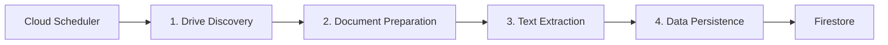

# AutoNyan

A Google Cloud Functions project demonstrating serverless document processing with TypeScript and Terraform. AutoNyan implements an event-driven pipeline for automated Google Drive document scanning, text extraction using Vision API, and data persistence to Firestore.

## Architecture Overview

AutoNyan uses an event-driven, serverless architecture on Google Cloud Platform with a 4-stage pipeline:



**Event Flow:** Scheduled trigger → PubSub → Storage events → Storage events → Database

### Pipeline Stages

1. **Drive Discovery**: Scheduled scanning of Google Drive folders to discover documents
2. **Document Preparation**: Downloads and copies documents from Google Drive to Cloud Storage
3. **Text Extraction**: Processes documents using Vision API for OCR and text extraction
4. **Data Persistence**: Stores extracted text and metadata in Firestore database

### Event Triggers

- **Scheduled Triggers**: Cloud Scheduler initiates periodic Drive scans
- **PubSub Triggers**: Message-based communication between discovery and preparation stages
- **Storage Triggers**: New file uploads automatically trigger processing stages

### Key Technologies

- **Cloud Functions v2**: Serverless compute with Node.js runtime
- **PubSub**: Asynchronous messaging between pipeline stages
- **Cloud Storage**: Document staging and results storage
- **Vision API**: OCR and text extraction from documents
- **Firestore**: NoSQL database for extracted text and metadata
- **Terraform**: Infrastructure as Code for all cloud resources

## Features

- **Event-Driven Architecture**: Fully asynchronous pipeline with automatic retries
- **TypeScript**: Full type safety with strict typing and comprehensive testing
- **Infrastructure as Code**: Terraform modules for reproducible deployments
- **Google Drive Integration**: Advanced Drive API operations with pagination support
- **Document Processing**: Automated scanning and text extraction from multiple file formats
- **Modular Design**: Each function is independently deployable and testable
- **Security-First CI/CD**: GitHub Actions with Workload Identity Federation
- **Dev Container**: Pre-configured development environment with all tools

## Prerequisites

- **Node.js**: Version specified in `.nvmrc` file
- **Google Cloud SDK**: [Installation guide](https://cloud.google.com/sdk/docs/install)
- **Terraform**: Version >= 1.0 ([Download](https://www.terraform.io/downloads.html))
- **Google Cloud Project**: With billing enabled
- **nvm**: Recommended for Node.js version management ([Install nvm](https://github.com/nvm-sh/nvm))
- **Docker**: Required for dev container workflow ([Install Docker](https://www.docker.com/))

## Quick Start

### Option 1: Dev Container (Recommended)

1. Install [VS Code](https://code.visualstudio.com/) and [Dev Containers extension](https://marketplace.visualstudio.com/items?itemName=ms-vscode-remote.remote-containers)
2. Open this project in VS Code
3. Reopen in dev container when prompted (or use `Dev Containers: Reopen in Container`)
4. Authenticate with Google Cloud:
   ```bash
   gcloud auth application-default login
   gcloud config set project YOUR_PROJECT_ID
   ```

### Option 2: Local Development

1. Install prerequisites listed above
2. Install Node.js version from `.nvmrc`:
   ```bash
   nvm install && nvm use
   ```
3. Install dependencies:
   ```bash
   npm install
   ```
4. Authenticate with Google Cloud:
   ```bash
   gcloud auth application-default login
   gcloud config set project YOUR_PROJECT_ID
   ```

### Configuration

#### 1. Terraform Backend Setup

Set up remote state storage in Cloud Storage:

```bash
# Optional: Configure custom bucket name and location
export TF_STATE_BUCKET="your-custom-bucket-name"
export TF_STATE_LOCATION="your-preferred-region"

# Run the setup script
npm run setup:terraform-backend

# Initialize Terraform
npm run terraform:init
```

#### 2. Project Variables

Copy the example configuration file:

```bash
cp terraform/terraform.tfvars.example terraform/terraform.tfvars
```

Edit `terraform/terraform.tfvars` with your values:

```hcl
project_id              = "your-gcp-project-id"
region                  = "us-central1"
drive_folder_id         = "your-google-drive-folder-id"
drive_scanner_schedule  = "0 9 * * 1"  # Weekly on Mondays at 9 AM UTC
```

**Finding Your Drive Folder ID:**
- Open Google Drive in your browser
- Navigate to the folder you want to scan
- Copy the ID from the URL: `https://drive.google.com/drive/folders/FOLDER_ID_HERE`
- Use `"root"` to scan entire Drive (after sharing)

#### 3. Deploy Infrastructure

```bash
npm run deploy
```

This command builds the functions and deploys all infrastructure via Terraform.

#### 4. Configure Google Drive Access

Google Drive requires **manual folder sharing** with the service account:

1. Get the service account email:
   ```bash
   terraform output service_account_email
   ```

2. Share your Google Drive folders:
   - Open [Google Drive](https://drive.google.com)
   - Right-click the folder(s) to share
   - Click "Share"
   - Add the service account email as "Editor"
   - Click "Send"

3. Test the setup:
   ```bash
   # Trigger a manual scan (replace topic name from terraform output)
   gcloud pubsub topics publish SCAN_TRIGGER_TOPIC --message='{"folderId":"YOUR_FOLDER_ID"}'
   ```

**Why Manual Sharing?**
Drive API doesn't support project-level IAM roles. Service accounts can only access explicitly shared folders, ensuring least-privilege access and preventing accidental access to unintended files.

## Development Workflows

### Building & Testing

```bash
# Build all functions
npm run build

# Run tests for all functions
npm test

# Run tests with coverage
npm run test:coverage

# Clean build artifacts
npm run clean
```

**Available test commands:**
See individual function workspaces in `src/functions/*/package.json` for function-specific scripts.

### Code Quality

```bash
# Run all linters and formatters
npm run lint
npm run format

# Check specific file types
npm run lint:ts          # TypeScript linting
npm run lint:yaml        # YAML linting
npm run lint:terraform   # Terraform linting
npm run lint:json        # JSON linting
npm run lint:sh          # Shell script linting
```

**Pre-commit workflow:**
Always run `npm run lint && npm run format` before committing to ensure code quality standards.

### Infrastructure Management

```bash
# Initialize Terraform (first time or after backend changes)
npm run terraform:init

# Preview infrastructure changes
npm run terraform:plan

# Apply infrastructure changes
npm run terraform:apply

# Validate Terraform configuration
npm run terraform:validate

# Destroy all infrastructure (use with caution)
npm run terraform:destroy
```

**Terraform workflow:**
1. Modify infrastructure in `terraform/` or `terraform/modules/`
2. Run `npm run terraform:plan` to preview changes
3. Review the plan carefully
4. Run `npm run terraform:apply` to apply changes
5. Verify resources in Google Cloud Console

### Deployment

**Local Deployment:**
```bash
npm run deploy
```

**CI/CD Deployment:**
The project uses GitHub Actions for automated testing and validation. See [GitHub Actions Setup](#github-actions-cicd-optional) for configuration.

## Project Structure

```
.
├── src/
│   ├── functions/          # Cloud Functions (npm workspaces)
│   │   ├── drive-scanner/
│   │   ├── doc-processor/
│   │   ├── text-vision-processor/
│   │   └── text-firebase-writer/
│   └── shared/             # Shared utilities across functions
├── terraform/              # Infrastructure as Code
│   ├── modules/            # Terraform modules (one per function)
│   ├── main.tf
│   ├── variables.tf
│   └── terraform.tfvars.example
├── scripts/                # Build and setup scripts
├── .devcontainer/          # Dev container configuration
├── .github/workflows/      # CI/CD workflows
├── dist/                   # Build output (generated)
├── CLAUDE.md               # AI assistant development guide
├── README.md               # This file
└── package.json            # Root workspace configuration
```

### Architectural Patterns

**npm Workspaces:**
Each Cloud Function is an independent npm workspace with its own dependencies, tests, and configuration. Shared code lives in `src/shared/`.

**Terraform Modules:**
Infrastructure is organized into modules matching the function structure. Each module manages:
- Cloud Function resource
- Service account with least-privilege IAM
- Event triggers (PubSub or Storage)
- Related resources (topics, storage buckets)

**Co-located Tests:**
Tests live alongside implementation code in each function directory, following the pattern `index.test.ts` next to `index.ts`.

## Google Drive Integration

### Supported File Types

AutoNyan can process the following document types:
- **PDF documents**: `.pdf`
- **Microsoft Office**: Word (`.doc`, `.docx`), Excel (`.xls`, `.xlsx`), PowerPoint (`.ppt`, `.pptx`)
- **Google Workspace**: Docs, Sheets, Slides
- **Text files**: `.txt`, `.rtf`

The system handles folders with unlimited files using pagination.

### Drive Operations

The document pipeline provides these Drive API operations:
- List files with pagination
- Create folders in shared areas
- Move files between folders
- Copy files within accessible areas
- Search files by name and MIME type
- Retrieve folder metadata

### Manual Triggers

Trigger document scanning manually via PubSub:

```bash
# Get the PubSub topic name from Terraform
terraform output -raw drive_scan_topic_name

# Trigger a folder scan
gcloud pubsub topics publish <TOPIC_NAME> --message='{"folderId":"YOUR_FOLDER_ID"}'

# Scan entire accessible Drive
gcloud pubsub topics publish <TOPIC_NAME> --message='{"folderId":"root"}'
```

### Permissions Model

**What the service account CAN do** (in shared folders only):
- List files and folders
- Read file metadata and content
- Create new folders
- Move and copy files
- Download documents for processing

**What the service account CANNOT do:**
- Access unshared folders or files
- Delete files or folders
- Modify sharing permissions
- Access other users' private Drive content

## GitHub Actions CI/CD (Optional)

AutoNyan includes a security-first CI/CD pipeline with GitHub Actions.

### Pipeline Security Model

- **Workload Identity Federation**: No service account keys stored in GitHub
- **PR Author Detection**: Different permissions for repository owners vs. Dependabot vs. external contributors
- **Progressive Stages**: Each stage must pass before the next stage runs
- **Manual Override**: Repository owners can trigger infrastructure validation with comments

### Pipeline Stages

1. **Code Quality**: Linting and formatting checks
2. **Testing**: Unit tests and coverage thresholds
3. **Infrastructure Validation**: Terraform plan (auto-triggered for owner PRs)
4. **Build**: Create deployment packages (auto-triggered after successful validation)
5. **Deploy**: Manual or scheduled only (not automatic)

### Configuration

For detailed GitHub Actions setup instructions, see [GITHUB_ACTIONS_SETUP.md](./GITHUB_ACTIONS_SETUP.md).

**Required Variables** (Settings → Secrets and variables → Actions → Variables):
- `TF_STATE_BUCKET`: Terraform state storage bucket
- `TF_STATE_LOCATION`: Cloud Storage bucket location
- `DRIVE_FOLDER_ID`: Google Drive folder ID for scanning
- `DRIVE_SCANNER_SCHEDULE`: Cron schedule (e.g., `"0 9 * * 1"`)

**Required Secrets**:
- `WIF_PROVIDER`: Workload Identity Federation provider
- `WIF_SERVICE_ACCOUNT`: Service account email for GitHub Actions

**Setup command:**
```bash
npm run setup:github-actions
```

## Adding New Functions

To add a new function to the pipeline:

### 1. Create Function Workspace

```bash
mkdir -p src/functions/my-new-function
cd src/functions/my-new-function
npm init -y
```

Set up the workspace structure following existing functions.

### 2. Implement Event Handler

Create `index.ts` with a CloudEvent handler:

```typescript
import { CloudEvent } from '@google-cloud/functions-framework';

export const myNewFunction = async (
  cloudEvent: CloudEvent<YourDataType>
): Promise<Result> => {
  // Your implementation
};
```

### 3. Add Tests

Create `index.test.ts` following the existing test patterns:
- Mock Google Cloud services
- Test with sample CloudEvents
- Achieve coverage thresholds

### 4. Create Terraform Module

Create `terraform/modules/my-new-function/` with:
- Service account and IAM bindings
- Cloud Function resource
- Event trigger configuration (PubSub or Storage)
- Required infrastructure (buckets, topics, etc.)

### 5. Wire Up in Main Configuration

Add the module to `terraform/main.tf` and connect it to the pipeline.

### 6. Build and Deploy

```bash
npm run deploy
```

## Troubleshooting

### Common Issues

**Drive Access Errors:**
- Verify the folder has been shared with the service account
- Check the service account email from `terraform output service_account_email`
- Ensure "Editor" permissions were granted
- Wait a few minutes after sharing for permissions to propagate

**Terraform State Lock:**
- Another process may be running Terraform concurrently
- Automatic cleanup on failure is built into CI/CD workflows
- For manual unlock in emergencies, use the GitHub Actions workflow:
  1. Go to Actions → "Unlock Terraform State (Manual)"
  2. Click "Run workflow"
  3. Type "UNLOCK" in the confirmation field
  4. Run the workflow to safely remove the lock
- Local development: `terraform -chdir=terraform force-unlock LOCK_ID`
- The unlock workflow uses the same concurrency group as plan/deploy for safety

**Function Timeout:**
- Check Cloud Functions logs: `gcloud functions logs read FUNCTION_NAME`
- Adjust timeout in the function's Terraform module
- Consider batch size for processing operations

**Build Failures:**
- Ensure Node.js version matches `.nvmrc`
- Run `npm clean` and rebuild
- Check for TypeScript errors: `npm run lint:ts`

### Viewing Logs

```bash
# View function logs
gcloud functions logs read FUNCTION_NAME --region=REGION

# Stream logs in real-time
gcloud functions logs read FUNCTION_NAME --region=REGION --follow

# View logs in Cloud Console
# Navigate to Cloud Functions → Select function → Logs tab
```

### Monitoring

Monitor your pipeline in Google Cloud Console:
- **Cloud Functions**: View invocations, errors, and performance metrics
- **Cloud Storage**: Monitor bucket usage and object counts
- **PubSub**: Track message delivery and subscription backlogs
- **Firestore**: Query stored documents and metadata

## Resources

- [Cloud Functions Documentation](https://cloud.google.com/functions/docs)
- [Terraform Google Provider](https://registry.terraform.io/providers/hashicorp/google/latest/docs)
- [Google Drive API](https://developers.google.com/drive/api/guides/about-sdk)
- [Cloud Vision API](https://cloud.google.com/vision/docs)
- [Firestore Documentation](https://cloud.google.com/firestore/docs)

## Maintaining This Document

**When to update README.md:**

- ✅ **Architecture changes**: When adding/removing pipeline stages or changing the event flow
- ✅ **New major features**: When adding significant new capabilities (e.g., new data sources, new output formats)
- ✅ **Setup process changes**: When prerequisites or configuration steps change
- ✅ **Troubleshooting updates**: When discovering new common issues and solutions

**What NOT to update:**

- ❌ **Specific function names**: Let code/Terraform be the source of truth
- ❌ **Exact command syntax**: Reference `package.json` instead
- ❌ **Version numbers**: Use relative references (e.g., "version in `.nvmrc`")
- ❌ **Implementation details**: Keep focus on concepts and workflows

**Maintenance principle:** Keep documentation high-level and workflow-focused. Implementation details should be discovered from code, not duplicated in documentation.

## Contributing

For development patterns, code conventions, and AI-assisted development guidelines, see [CLAUDE.md](./CLAUDE.md).

## License

This project is provided as-is for demonstration and educational purposes.
